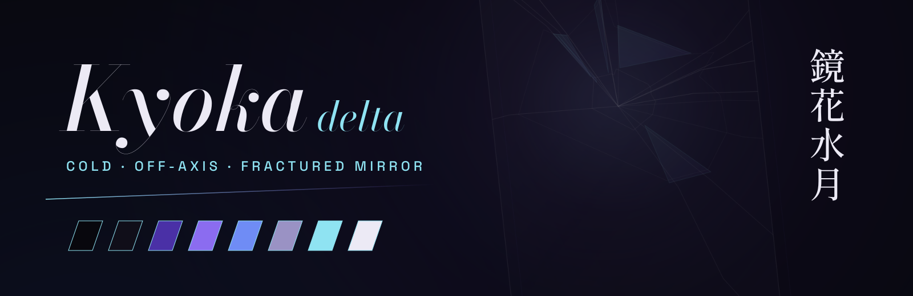

<p align="center"></p>

<p align="center"><sub>yokoso watashi no soul society ╱ ようこそ 私のソウル・ソサエティ</sub></p>

# ▰ Kyoka delta

A mirror, struck once. Cold, off-axis, fractured: void black, a violet aura, ice for data, pewter and frost for the rest. Nothing is centred that does not have to be. The first of two Kyoka themes; the other is [hattin-kyoka-alpha](https://github.com/houssemMekhelbi/hattin-kyoka-alpha).

## ▱ Palette

| | | |
|---|---|---|
| **void** | `#08070D` | the ground |
| **panel** | `#100E19` | panels |
| **violet** | `#4A30A6` | structure |
| **violet lit** | `#8B6CF0` | focus |
| **indigo** | `#6F8CF5` | activity |
| **pewter** | `#9A92C4` | muted text |
| **ice** | `#8FE3F2` | data, attention |
| **frost** | `#ECEAF5` | text |

## ▱ Shards

- **Windows**: sharp glass, an ice → violet border at 300°, a violet glow on focus,
  an off-axis shadow, a cracked-mirror wallpaper
- **Waybar**: leaning panes, a shard under the clock, ▰ ▱ workspaces, NET / SYS / ▱
  drawers, VOL, BAT, NOTIF, IDLE
- **mawaqit** banners on a fractured card, **yawm** popups
- **Launcher** (SUPER+D), **hyprlock** (the saying, no username), **GTK / Thunar**,
  the **KyokaDelta** icon theme, **swaync**
- **Terminals**: foot, alacritty, ghostty, tmux and a zsh prompt
- **Type**: Bodoni Moda with Shippori Mincho and Amiri, Space Grotesk, JetBrains Mono

## ▱ Requirements

- Arch Linux (the package check uses `pacman`)
- Hyprland 0.56 or newer: the configuration is written in Lua
- waybar 0.15 or newer
- the packages in `kyoka-delta/packages.txt`:

```sh
sudo pacman -S --needed $(grep -v '^#' kyoka-delta/packages.txt)
```

## ▰ Through the glass

> [!WARNING]
> This is a whole desktop, not a colour scheme. It replaces every file listed
> in `kyoka-delta/MANIFEST`: the Hyprland, waybar, terminal, tmux, GTK and fontconfig
> configuration among them, and the theme line in `~/.zshrc`.
> Everything it replaces is backed up first.

```sh
git clone https://github.com/houssemMekhelbi/hattin-kyoka-delta.git
cd hattin-kyoka-delta
./kyoka-delta/restore.sh --dry-run   # show what would change, touch nothing
./kyoka-delta/restore.sh             # apply
```

`restore.sh` then:

1. reports missing packages;
2. backs up every path it is about to replace to `~/themes/.backups/before-kyoka-delta-<timestamp>/`;
3. copies the theme's `home/` over `$HOME` and removes the paths in its `ABSENT`;
4. points `~/.zshrc` at the theme's prompt;
5. applies its `gsettings.txt` and refreshes the font and icon caches;
6. builds the mawaqit-api image if it is missing, enables the user services and
   reloads Hyprland, waybar, hyprpaper, swaync and tmux.

`--files-only` copies the files and gsettings and leaves the services alone.

## ▱ Back out

Copy the backup folder back over `$HOME`.

## ▱ Prayer times

Prayer times come from [mawaqit.net](https://mawaqit.net) through a local copy of
[mawaqit-api](https://github.com/mrsofiane/mawaqit-api), run by podman on 127.0.0.1.
List your mosques in `~/.config/mawaqit/mosques`, one `<mawaqit.net slug> | <label>`
per line; scroll or right-click the prayer module to switch between them.

## ▱ Other reflections

This is one of the hattin themes. They share one behaviour (binds, workspaces,
bar modules) and differ only in look. Clone several side by side and run the
`restore.sh` of the one you want: each switch removes what the previous theme
left that the new one does not use.

## ▱ Licence

MIT, see [LICENSE](LICENSE). The fonts in `<theme>/home/.local/share/fonts/` are
under the SIL Open Font License; each licence text sits next to its font.
mawaqit-api (`<theme>/home/.local/share/mawaqit-api/`) is MIT, © Sofiane Louchene.
